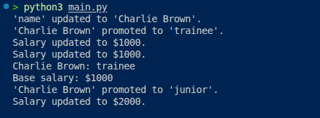

# Employee Salary Tracker

A simple Python project that demonstrates how to build an employee management system using Object-Oriented Programming (OOP).

This project focuses on:

* Employee data management
* Salary validation
* Promotions
* Property setters/getters
* Encapsulation in Python

---

## Features

* Create employee objects
* Assign employee levels
* Automatically manage salaries
* Prevent invalid promotions
* Prevent salary violations
* Validate user input using property setters
* Display employee information cleanly

---

### Employee Levels

| Level     | Base Salary |
| --------- | ----------- |
| trainee   | $1000       |
| junior    | $2000       |
| mid-level | $3000       |
| senior    | $4000       |

---

### Technologies Used

* Python3
* Object-Oriented Programming (OOP)

---

#### Project Structure

```bash
employee_salary_tracker/
│
├── main.py
└── README.md
```

---

#### Example Output

```bash
'name' updated to 'Charlie Brown'.
'Charlie Brown' promoted to 'trainee'.
Salary updated to $1000.

Charlie Brown: trainee
Base salary: $1000

'Charlie Brown' promoted to 'junior'.
Salary updated to $2000.
```

---

#### How to Run

##### Clone the Repository

```bash
git clone <your-repository-url>
```

##### Navigate Into the Project Folder

```bash
cd employee_salary_tracker
```

##### Run the Program

```bash
python main.py
```

---

##### Key Python Concepts Practiced

* Classes and Objects
* Encapsulation
* Property Decorators
* Getters and Setters
* Validation Logic
* Exception Handling
* String Representation Methods

---

##### Learning Goal

This project was built as part of a Python learning journey focused on becoming a stronger Backend Engineer and Software Engineer.

---

##### Author

Built by Ikwuka Okoye

---

###### Program Output


